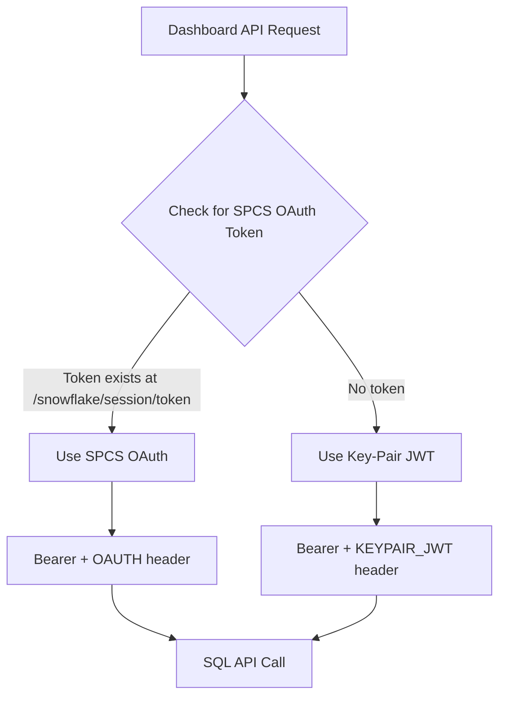

# Dashboard Authentication Documentation Plan

## Current Setup Summary

### Account Configuration
From [spcs-spec.yaml](spcs-spec.yaml):
- **Account**: `sfseeurope-eu-demo86c`
- **Host**: `sfseeurope-eu-demo86c.snowflakecomputing.com`
- **User**: `admin`
- **Warehouse**: `C360_WH`

### Database and Schema
- **Database**: `CUSTOMER_360_DEMO`
- **Schema**: `PUBLIC`

### Tables Used by Dashboard
From [app/api/dashboard/route.ts](app/api/dashboard/route.ts), the dashboard queries these tables:

| Table | Purpose |
|-------|---------|
| `CUSTOMER_360_DEMO.PUBLIC.CUSTOMER_DEMOGRAPHICS` | Age groups, income brackets, total pension value |
| `CUSTOMER_360_DEMO.PUBLIC.CUSTOMER_PENSION_DETAILS` | Pension types, fund values |
| `CUSTOMER_360_DEMO.PUBLIC.CUSTOMER_INTERACTION_AND_LEADS` | Marketing channels |
| `CUSTOMER_360_DEMO.PUBLIC.CUSTOMER_COMMUNICATION` | Communication preferences |

### Authentication Method
The dashboard uses a **dual authentication approach**:

1. **SPCS OAuth** (when running in Snowpark Container Services):
   - Reads token from `/snowflake/session/token`
   - Uses `Authorization: Bearer <token>` with `X-Snowflake-Authorization-Token-Type: OAUTH`

2. **Key-Pair JWT** (fallback for local development):
   - Reads private key from `~/.snowflake/keys/rsa_key.p8`
   - Generates JWT signed with RS256 algorithm
   - Uses `Authorization: Bearer <jwt>` with `X-Snowflake-Authorization-Token-Type: KEYPAIR_JWT`

### SQL API Endpoint
All queries go to: `https://{host}/api/v2/statements`

### Current Issue
The SPCS OAuth token (error 395092) is **not authorized** for SQL API calls. The service token is meant for service identity, not for executing SQL queries. This is why the Dashboard shows "Retry" - the authentication fails.

## Deliverable

Create a `docs/DASHBOARD_AUTH.md` file documenting:
1. Authentication flow diagram
2. Environment variables used
3. Tables and columns accessed
4. Current limitations and known issues