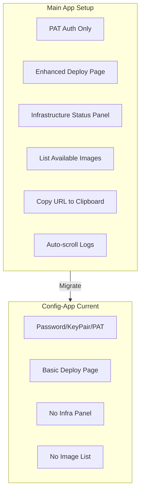

# Plan: Migrate Setup Wizard to Config-App

## Overview

The main webapp (`app/setup/`) has evolved with enhanced features that need to be migrated to the standalone `config-app`. This plan synchronizes the config-app with the latest main app setup functionality.

## Current State Analysis

### Files to Migrate

**Main App (Source)** | **Config-App (Target)** | **Status**
---|---|---
`lib/setup/constants.ts` | `config-app/lib/constants.ts` | Minor diff (PAT_SECRET missing)
`lib/setup/snowflake.ts` | `config-app/lib/snowflake.ts` | Different auth approach
`app/api/setup/list-images/route.ts` | - | Missing in config-app
`app/api/setup/save-pat/route.ts` | - | Missing in config-app
`app/api/setup/register-model/route.ts` | - | Missing in config-app
`app/setup/deploy/page.tsx` | `config-app/app/deploy/page.tsx` | Missing enhanced features

### Key Differences



## Implementation Details

### Task 1: Sync lib files

Update [config-app/lib/constants.ts](config-app/lib/constants.ts):
- Add `PAT_SECRET: "C360_PAT"` to SNOWFLAKE_OBJECTS
- Add `"secret"` to SnowflakeObjectType union

Update [config-app/lib/snowflake.ts](config-app/lib/snowflake.ts):
- Change PAT auth from `password: config.pat` to proper `PROGRAMMATIC_ACCESS_TOKEN` authenticator:
```typescript
if (config.authMethod === "pat" && config.pat) {
  connectionConfig.authenticator = "PROGRAMMATIC_ACCESS_TOKEN";
  connectionConfig.token = config.pat;
}
```

### Task 2: Add missing API routes

Copy these routes from main app to config-app:

1. **list-images** - [app/api/setup/list-images/route.ts](app/api/setup/list-images/route.ts) to `config-app/app/api/list-images/route.ts`
   - Lists Docker images in Snowflake image repository
   - Used by deploy page to show available image tags

2. **save-pat** - [app/api/setup/save-pat/route.ts](app/api/setup/save-pat/route.ts) to `config-app/app/api/save-pat/route.ts`
   - Stores PAT as Snowflake Secret object
   - Required for SQL API authentication in deployed app

3. **register-model** - [app/api/setup/register-model/route.ts](app/api/setup/register-model/route.ts) to `config-app/app/api/register-model/route.ts`
   - Creates ML model stage and registration procedure

### Task 3: Update existing API routes

Update these config-app routes to use proper PAT authentication:

- [config-app/app/api/check-objects/route.ts](config-app/app/api/check-objects/route.ts)
- [config-app/app/api/deploy/route.ts](config-app/app/api/deploy/route.ts)
- [config-app/app/api/get-app-url/route.ts](config-app/app/api/get-app-url/route.ts)
- [config-app/app/api/run-network-tests/route.ts](config-app/app/api/run-network-tests/route.ts)

Change from:
```typescript
if (config.authMethod === "pat") {
  connectionConfig.password = config.pat;
}
```

To:
```typescript
if (config.authMethod === "pat" && config.pat) {
  connectionConfig.authenticator = "PROGRAMMATIC_ACCESS_TOKEN";
  connectionConfig.token = config.pat;
}
```

### Task 4: Enhance deploy page

Update [config-app/app/deploy/page.tsx](config-app/app/deploy/page.tsx) with features from [app/setup/deploy/page.tsx](app/setup/deploy/page.tsx):

**Add Infrastructure Status Panel:**
```typescript
// Add state
const [infraStatus, setInfraStatus] = useState<ObjectStatus[]>([]);
const [infraChecked, setInfraChecked] = useState(false);
const [copied, setCopied] = useState(false);
const logsEndRef = useRef<HTMLDivElement>(null);
const [availableImages, setAvailableImages] = useState<{tag: string; createdOn: string; digest: string}[]>([]);
```

**Add features:**
- Infrastructure status grid (4 columns showing required objects)
- "Reset State" button
- "Refresh" button for infrastructure
- Missing infrastructure warning alert
- Copy URL to clipboard button
- Available images list with tag selector
- Auto-scroll logs with `logsEndRef`

### Task 5: Sync generate-data API

Replace [config-app/app/api/generate-data/route.ts](config-app/app/api/generate-data/route.ts) with enhanced version from [app/api/setup/generate-data/route.ts](app/api/setup/generate-data/route.ts):

Key improvements:
- Weighted distributions for realistic data
- More detailed customer demographics
- Richer product data
- Better lead/interaction data

### Task 6: Account-scoped deploy state

Update deploy page to scope localStorage state to current account:

```typescript
// When loading state
const stored = localStorage.getItem("deployState");
if (stored) {
  const state = JSON.parse(stored);
  if (state.account === currentAccount) {
    // Load state
  } else {
    localStorage.removeItem("deployState");
  }
}

// When saving state
localStorage.setItem("deployState", JSON.stringify({
  account: snowflakeConfig.account,
  infrastructureReady,
  imagePushed,
  serviceStarted,
  appUrl,
}));
```

### Task 7: Testing

1. Run `npm run build` in config-app directory
2. Test Docker container: `./run-local.sh up`
3. Verify all pages work at http://localhost:3001
4. Test connection with PAT authentication
5. Verify infrastructure status panel shows correctly
6. Test image listing functionality

## File Changes Summary

| File | Action |
|------|--------|
| `config-app/lib/constants.ts` | Update (add PAT_SECRET) |
| `config-app/lib/snowflake.ts` | Update (fix PAT auth) |
| `config-app/app/api/list-images/route.ts` | Create (copy from main) |
| `config-app/app/api/save-pat/route.ts` | Create (copy from main) |
| `config-app/app/api/register-model/route.ts` | Create (copy from main) |
| `config-app/app/api/check-objects/route.ts` | Update (PAT auth) |
| `config-app/app/api/deploy/route.ts` | Update (PAT auth) |
| `config-app/app/api/get-app-url/route.ts` | Update (PAT auth) |
| `config-app/app/api/run-network-tests/route.ts` | Update (PAT auth) |
| `config-app/app/api/generate-data/route.ts` | Replace (enhanced data) |
| `config-app/app/deploy/page.tsx` | Major update (infra panel) |
